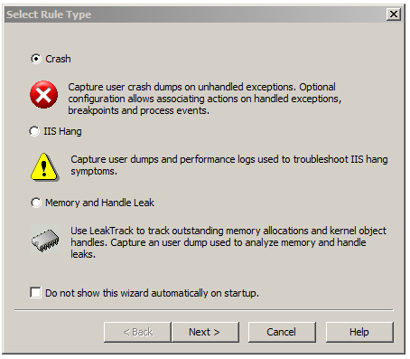
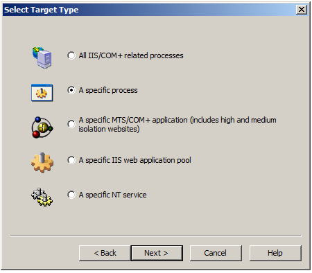
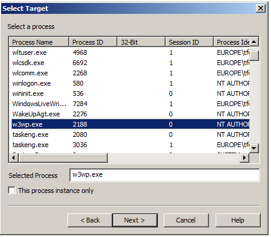
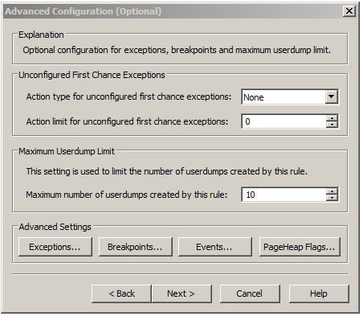
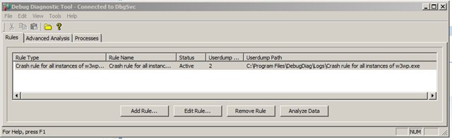

# Debugger une application .NET qui crash avec des règles dans Debug Diag

## Description du problème

Dans l'event log Windows d'un serveur web IIS :

```Windows
The application crashes with the following event in the eventlog

Log Name:      Application
Source:           Application Error
Date:              2009-03-20 11:12:09
Event ID:        1000
Task Category: (100)
Level:              Error
Keywords:       Classic
User:               N/A
Computer:       MYMACHINE
Description:
Faulting application w3wp.exe, version 7.0.6001.18000, time stamp 0x47919413, faulting module kernel32.dll, version 6.0.6001.18000, time stamp 0x4791a76d, exception code 0xe053534f, fault offset 0x000442eb, process id 0x%9, application start time 0x%10.
```

On voit que l'application w3wp.exe crash

## Installer Debug Diag

Télécharger et installer Debug Diag : http://www.microsoft.com/en-us/download/details.aspx?id=40336

## Capturer le crash

Lancer l'application Debug Diag et créer une nouvelle règle.

Sélectionner le type de règle



Dans l'exemple ici, on veut capturer le crash d'un processus particulier : w3wp.exe







La règle est maintenant active



## Lire le fichier du debug

Pour analyser le fichier de debug créer, il suffit de le faire avec WinDBG et les commandes standards
<WRAP center round important 60%>
Ne pas oublier de mettre le chemin des symboles

```windows
SRV*c:\websymbols*http://msdl.microsoft.com/download/symbols
```


## Source

http://blogs.msdn.com/b/tess/archive/2009/03/20/debugging-a-net-crash-with-rules-in-debug-diag.aspx